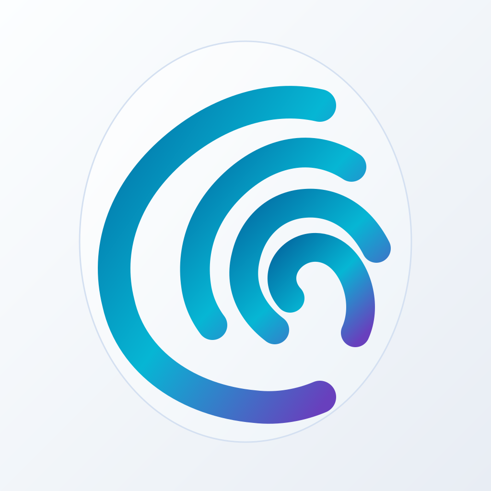

# Lunar Aegis brand icons

The owner selected a fingerprint-shaped crescent after reviewing the original
shield/lock concept. Four rounded ridges form one mark. The app UI uses its
single-color form; the frosted dark and pearl light app icons use the same
geometry with different surface treatments. The oval belongs to the app-icon
composition and does not appear in the inline UI mark.

## Production sources

| Role | Source |
| --- | --- |
| Inline UI mark | [brands/oxid/assets/logo.svg](../../brands/oxid/assets/logo.svg) |
| Gradient mark | [brands/oxid/assets/mark-gradient.svg](../../brands/oxid/assets/mark-gradient.svg) |
| Dark and light mobile artwork | [app-icon-dark.svg](../../brands/oxid/assets/app-icon-dark.svg), [app-icon-light.svg](../../brands/oxid/assets/app-icon-light.svg) |
| Android launcher composition | [app-icon-android.svg](../../brands/oxid/assets/app-icon-android.svg) |
| Desktop composition | [desktop-icon.svg](../../brands/oxid/assets/desktop-icon.svg) |
| Bundled PNG, ICNS, ICO exports | [apps/oxid/icons/](../../apps/oxid/icons/) |
| Generator and platform rules | [docs/design/brand-identity.md](../../docs/design/brand-identity.md) |

The mark is built from four paths in
[`scripts/generate-oxid-brand-assets.py`](../../scripts/generate-oxid-brand-assets.py).
Regenerate all SVG and platform assets together after any geometry or color
change. The default app uses the dark icon on iOS, an Android composition with
the mark inside the launcher safe region, and a rounded icon for desktop.
The light icon is an approved alternate, not an active OS theme switch.

The icon colors draw from the [profile palette](profile.json): dark
`#07090E` and `#0F172A`, cyan `#06B6D4`, highlight `#38BDF8`, and identity
violet `#8B5CF6`. The inline mark inherits the semantic accent so it works
with the existing app tokens. Keep the five navigation icons in
[assets/icons/](assets/icons/) and their Home / Wallet / Scan / Documents /
Activity order; the app logo does not replace a navigation symbol.

## Provenance

The original UX Pilot export, including [logo-master.svg](assets/logo-master.svg)
and [logo-concept.jpg](assets/logo-concept.jpg), remains intact with its
recorded hashes. This later owner-approved mark supersedes those files for
app branding only. The snapshot still documents how the visual direction
developed; it is not a source for regenerating production icons.
