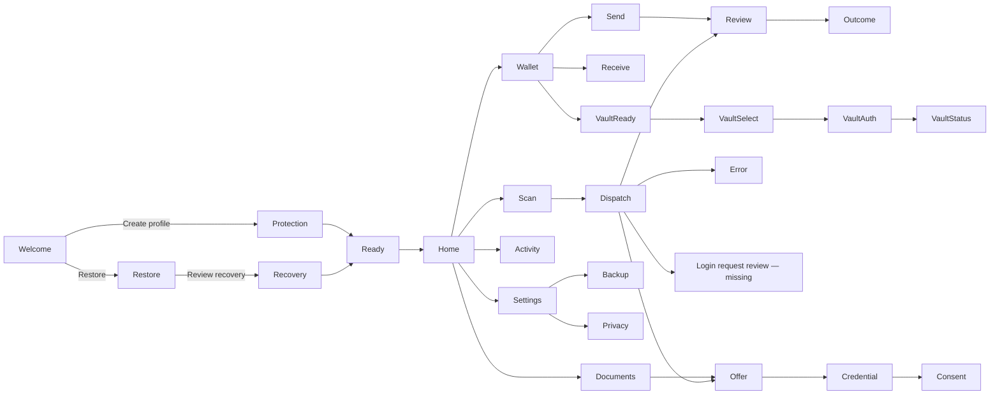

# Mobile flow map

This is a readable summary of the verified UX Pilot diagram. The
[full graph](flow.json) preserves all 37 nodes, 66 labeled transitions,
back/cancel branches, and design IDs. Use the graph for route work.

| Journey | Offline starting point | State |
| --- | --- | --- |
| First run and recovery | [Welcome](screens/png/XSwTg6CjwXruX8QP3tXy.png) | Proposed sequence |
| Home and five-slot shell | [Home](screens/png/kI1o6I63AKA1Z0AIAwHI.png) | Observed standalone state, restyled |
| Wallet, receive, send, outcome | [Wallet](screens/png/dnug5nrBQ8Edsf30jegU.png) | Wallet state observed; downstream journey proposed |
| Documents and disclosure | [Documents empty](screens/png/IakMIDPU6kDTYsHcoDYQ.png) | Empty state observed; offers and consent proposed |
| Shared Scan dispatcher | [Scan entry](screens/png/Yv3m128eEWimsftexS7J.png) | Proposed; login review is a documented gap |
| Settings and backup | [Settings](screens/png/THvwwHWmKVEB9tYpUvR6.png) | Proposed |
| Passport Vault | [Vault readiness](screens/png/5W0qFzdZIECOuCQQCk47.png) | Proposed |
| Activity and history | [Activity empty](screens/png/IxCp7AR4fTWsC8Q28qdc.png) | Empty state observed; timeline expansion proposed |

The diagram links a recovery review screen from two nodes; the manifest
contains its design once. A state label reflects product evidence, while the
Lunar Aegis rendering remains a design target.
