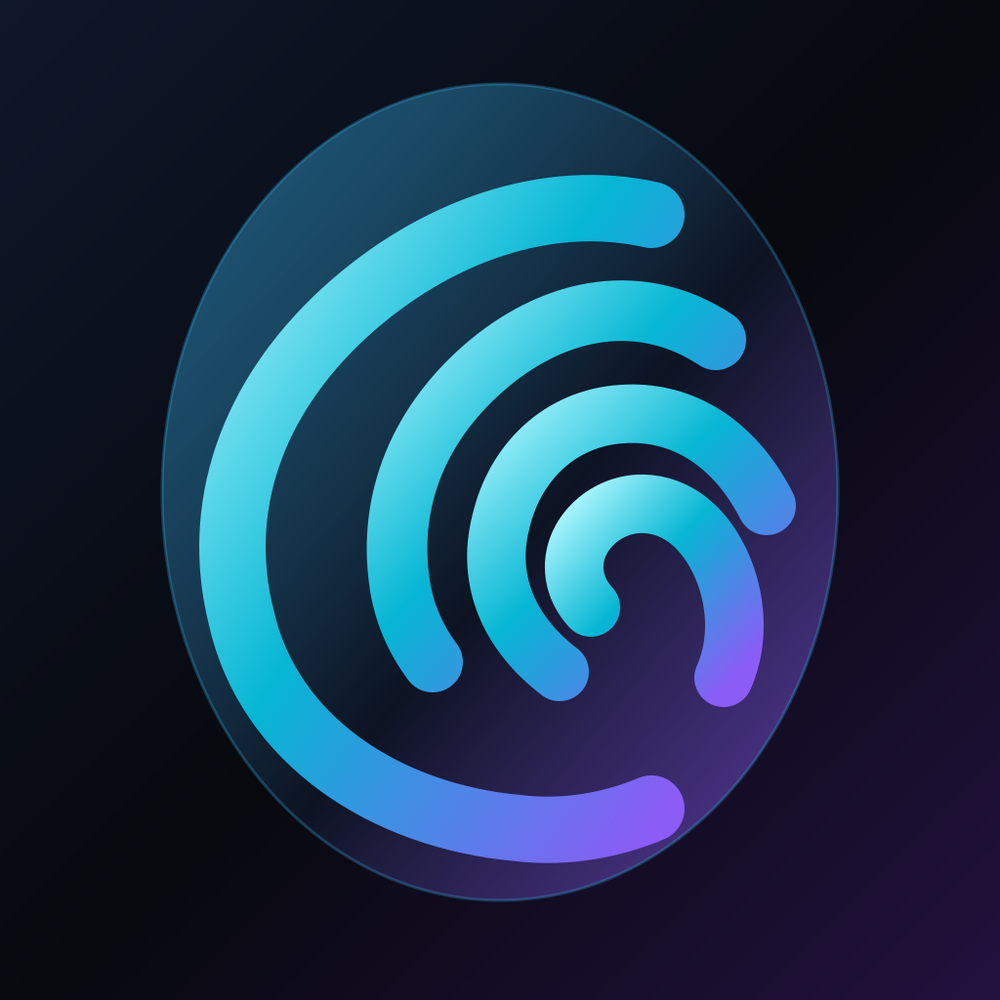
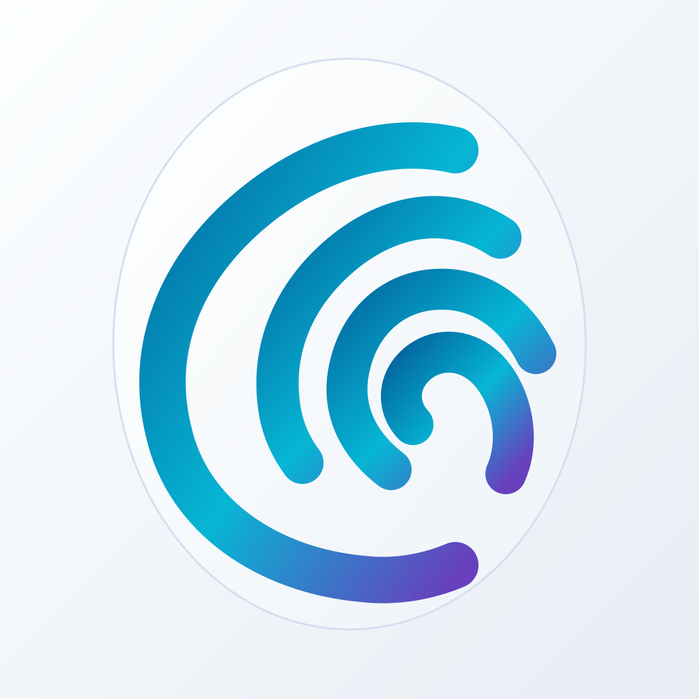

# Oxid brand identity

Oxid uses one fingerprint-shaped crescent across the app UI and its Android,
iOS, and desktop icons. The four ridges represent a person's identity; their
shared arc gives the mark its distinctive shape. The oval field is an icon
treatment, not part of the core mark. This keeps the in-app mark usable at
small sizes and in a single color.




## Logo family

| Asset | Use |
| --- | --- |
| [logo.svg](../../brands/oxid/assets/logo.svg) | Single-color inline mark used by the app header and onboarding. It inherits `currentColor` from the brand accent. |
| [mark-gradient.svg](../../brands/oxid/assets/mark-gradient.svg) | Standalone gradient mark for large artwork. |
| [app-icon-dark.svg](../../brands/oxid/assets/app-icon-dark.svg) | Primary full-bleed mobile icon: frosted cyan-violet oval on a Lunar Aegis dark tile. |
| [app-icon-light.svg](../../brands/oxid/assets/app-icon-light.svg) | Light alternate: pearl oval with a cyan-violet mark. |
| [app-icon-android.svg](../../brands/oxid/assets/app-icon-android.svg) | Android launcher composition with the complete mark inside the central safe region. |
| [desktop-icon.svg](../../brands/oxid/assets/desktop-icon.svg) | Rounded-square transparent-background composition for desktop bundles. |

The dark and light icons share **the same four vector paths**. Neither
variant changes the shape of the identity mark. Do not redraw individual
ridges, add a shield or lock, or replace the mark with a generic fingerprint.

## Color and composition

- **Dark tile:** Lunar Aegis background `#07090E`, raised surface
  `#0F172A`, and a restrained violet shadow. The mark moves from pale
  cyan `#A5F3FC` through primary `#06B6D4` to identity violet `#8B5CF6`.
- **Light tile:** pearl `#FCFEFF` to cool gray `#E8EDF4`. The mark moves
  from blue `#0369A1` through cyan `#06B6D4` to violet `#6840BD`.
- The oval is a quiet field behind the mark. Keep its outline low contrast;
  the fingerprint-crescent must remain the first thing seen.
- The small UI logo stays monochrome, so it can follow the dark and light
  brand tokens and remain legible in the header.

## Platform delivery

`apps/oxid/Dioxus.toml` points iOS at the opaque, square dark 1024 px icon
and Android at a separate dark export with the mark reduced into the launcher
safe region. It points desktop bundling at the generated PNG, macOS ICNS,
and Windows ICO files. iOS and Android apply their own icon masks, so the
mobile backgrounds fill the full square. The desktop export includes its own
rounded-square silhouette and transparency around it.
The Android mark fits within the [launcher icon safe region](https://developer.android.com/develop/ui/compose/system/icon_design_adaptive).

The light icon is a design-system alternate. It is exported as
`apps/oxid/icons/app-icon-light-1024.png`; app theme selection does not
currently switch the installed launcher icon.

## Regenerate

The source of truth is [generate-oxid-brand-assets.py](../../scripts/generate-oxid-brand-assets.py).
It writes every SVG from one set of paths and then renders the platform
files. From the repository root:

```sh
python3 -m venv /tmp/oxid-logo-renderer
/tmp/oxid-logo-renderer/bin/python -m pip install -r scripts/logo-requirements.txt
/tmp/oxid-logo-renderer/bin/python scripts/generate-oxid-brand-assets.py
```

The renderer also needs ImageMagick's `magick` command for the Windows ICO.
On macOS, `iconutil` produces the ICNS. Commit both SVG sources and generated
platform files after any geometry or color change. Inspect the 32 px desktop
PNG and both 1024 px mobile PNGs before changing the bundled icon.
