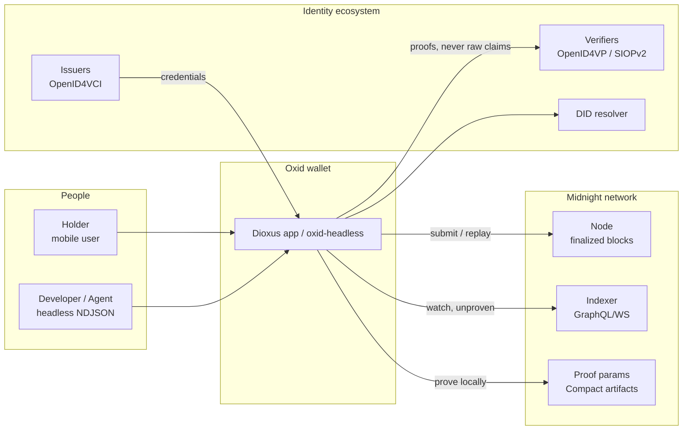
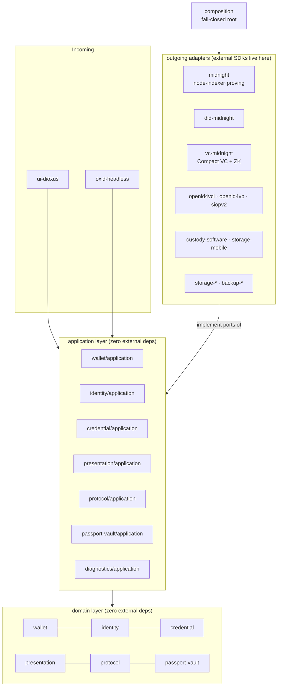
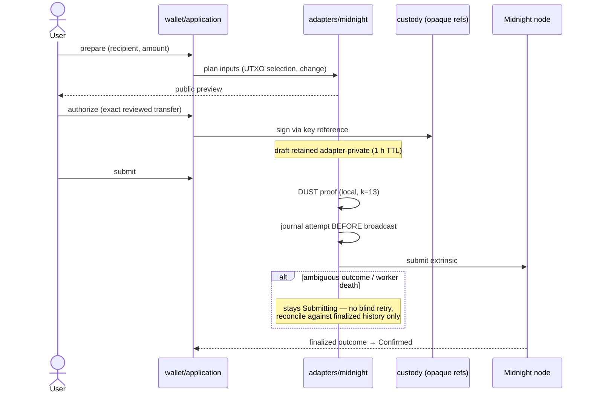
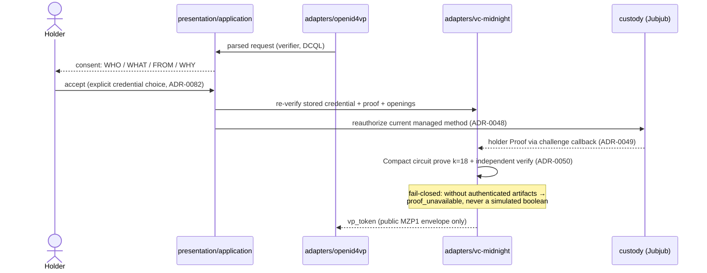
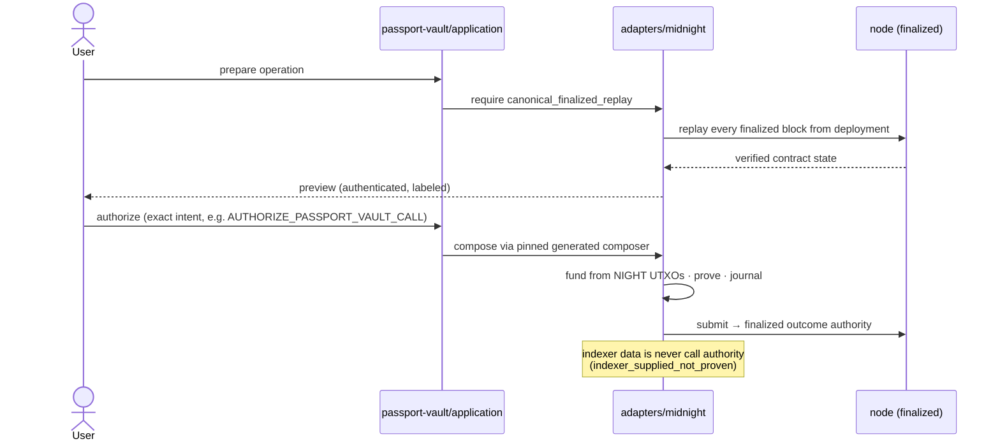

# System diagrams

Rendered from text (mermaid) so they stay reviewable in pull requests and
never rot as binary images. Each diagram names the crates it depicts —
when a crate moves, the diagram fails review, not reality.

## Context: Oxid in its ecosystem

## Containers: the hexagonal workspace (37 crates)

Rules enforced by `scripts/check-architecture.sh` (default-deny): domain and
application crates take **no external dependencies**; adapters convert
external types at the boundary; only `composition` joins adapters to ports.

## Sequence: unshielded transfer (persist-before-broadcast)

## Sequence: credential presentation with a real ZK proof

## Sequence: Passport Vault call (canonical replay required)

